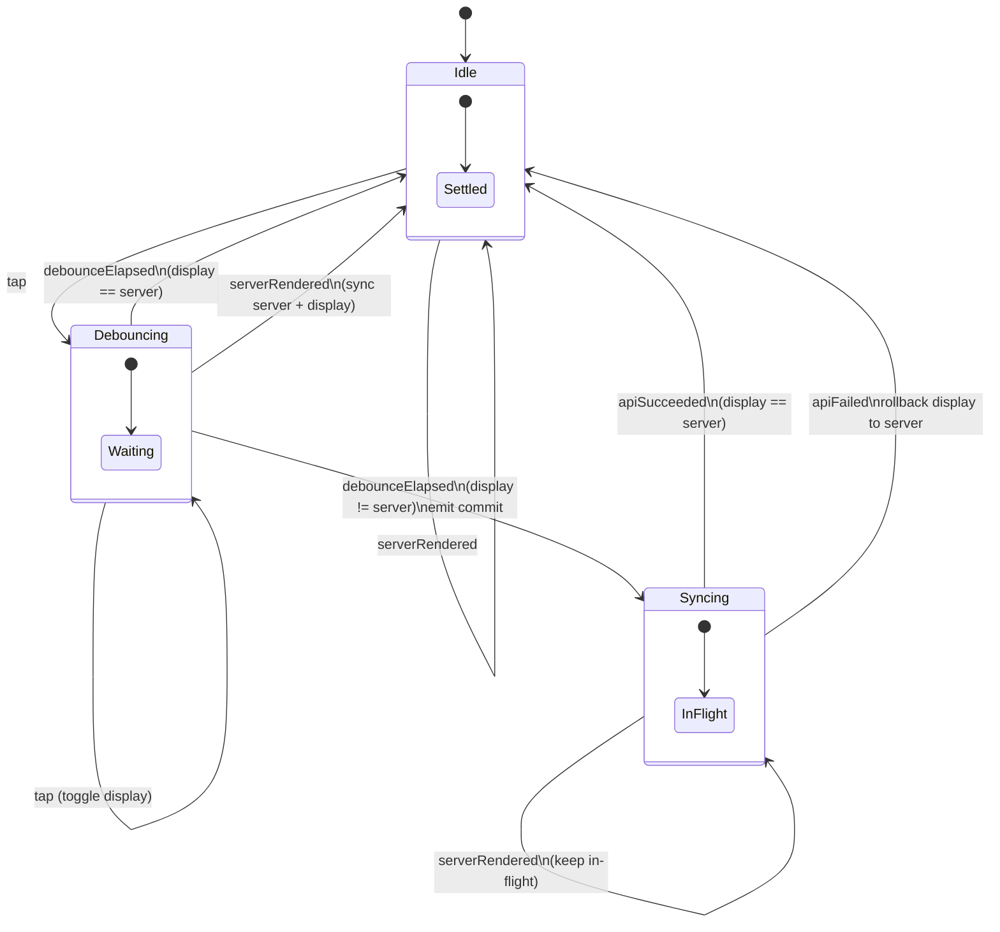

# Reaction Component (Like / Unlike)

Production-ready, reusable Like/Unlike interaction built with **Swift**, **UIKit**, and **Combine**.

## Components

| Component | Responsibility |
|-----------|----------------|
| `OAReaction` | Domain enum: `none` ↔ `heart` |
| `ReactionStateMachine` | Pure state transitions (no UIKit) |
| `ReactionController` | Headless logic: optimistic update, debounce, rollback, commit |
| `LikeButton` | `UIControl` — display, touch, animation, forwards events |

## Architecture

```
┌─────────────┐   acceptTap()    ┌────────────────────┐   commitPublisher   ┌──────────────┐
│  LikeButton │ ───────────────► │ ReactionController │ ──────────────────► │ API Consumer │
│  (UIKit)    │ ◄─────────────── │   (Combine only)   │                     │ (your layer) │
└─────────────┘ displayPublisher └────────────────────┘ ◄─ apiSucceeded()  └──────────────┘
                                        ▲                      apiFailed()
                                        │ render(serverReaction)
                                 External store / websocket
```

`ReactionController` does **not** import UIKit and does **not** know `LikeButton` exists.

## State Machine

### Snapshot

Each state is a single `ReactionSnapshot`:

```swift
struct ReactionSnapshot {
    var server: OAReaction    // server truth
    var display: OAReaction   // optimistic UI value
    var phase: ReactionPhase  // lifecycle
}
```

### Phase (`enum`, not booleans)

| Phase | Meaning |
|-------|---------|
| `idle` | Settled. No debounce, no in-flight commit. |
| `debouncing` | User tapped; waiting for debounce window. |
| `syncing(commit:)` | Commit emitted; waiting for `apiSucceeded` / `apiFailed`. |

### Events

| Event | Source |
|-------|--------|
| `tap` | `LikeButton` → `acceptTap()` |
| `debounceElapsed` | Combine `debounce` on tap stream |
| `apiSucceeded` | Consumer after API success |
| `apiFailed` | Consumer after API failure |
| `serverRendered` | External data (`render(serverReaction:)`) |

### Transition Rules

1. **tap** — Toggle `display` immediately. `idle` → `debouncing`. During `debouncing` / `syncing`, only `display` changes.
2. **debounceElapsed** — Only in `debouncing`. If `display == server` → `idle` (no commit). If `display != server` → `syncing(commit: display)` + emit commit. Ignored in `syncing`.
3. **apiSucceeded** — Only in `syncing`. `server = commit`. If `display == server` → `idle`. Else emit follow-up commit for current `display`.
4. **apiFailed** — Only in `syncing`. Roll `display` back to `server`, → `idle`.
5. **serverRendered** — Set `server` and `display` to external value. `idle` / `debouncing` → `idle`. During `syncing`, keep phase (in-flight request reconciles later). Never emits commit.

## State Diagram (Mermaid)



## Public API

### ReactionController

```swift
// Publishers
var displayPublisher: AnyPublisher<OAReaction, Never>  // UI binding
var commitPublisher: AnyPublisher<OAReaction, Never>   // trigger API

// Inputs
func acceptTap()
func render(serverReaction: OAReaction)
func apiSucceeded()
func apiFailed()

// Read-only
var currentDisplay: OAReaction
var currentServer: OAReaction
```

### LikeButton

```swift
let controller: ReactionController

init(controller: ReactionController)
init(initialServerReaction:configuration:)

// Forwards touch → acceptTap()
// Subscribes displayPublisher → updates UI + animation
```

## Usage Example

```swift
let button = LikeButton(initialServerReaction: .none)

button.controller.commitPublisher
    .sink { reaction in
        api.setReaction(reaction) { result in
            switch result {
            case .success:
                button.controller.apiSucceeded()
            case .failure:
                button.controller.apiFailed()
            }
        }
    }
    .store(in: &cancellables)

// External store update
store.reactionPublisher
    .sink { button.controller.render(serverReaction: $0) }
    .store(in: &cancellables)
```

## Test Coverage

All 7 required scenarios are covered in:

- `appTests/Reaction/ReactionStateMachineTests.swift` — pure transition tests
- `appTests/Reaction/ReactionControllerTests.swift` — Combine integration tests

| Case | Scenario | Expected |
|------|----------|----------|
| 1 | Single tap | Emit `heart` after debounce |
| 2 | Tap twice | No commit (back to `none`) |
| 3 | Tap during API + success | Follow-up emit `none` |
| 4 | API fail | Display rolls back to `none` |
| 5 | External `heart` | No extra commit |
| 6 | External `none` | Display syncs to `none` |
| 7 | 100 taps | No crash, ≤ 1 commit |

## Thread Safety

- State mutations guarded by `NSLock`
- `displayPublisher` uses `removeDuplicates()`
- `deinit` cancels all Combine subscriptions
- No retain cycles (`[weak self]` in controller sinks)

## Configuration

```swift
ReactionControllerConfiguration(
    debounceInterval: 0.5,          // default 500ms
    debounceScheduler: DispatchQueue(...),
    deliveryQueue: .main
)
```
